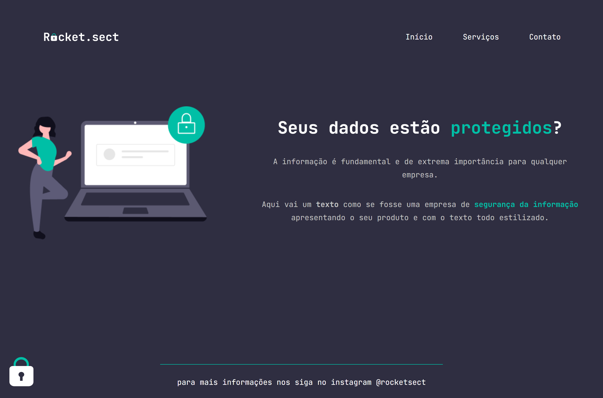

<h1 align="center">
    
</h1>

  <a href="#-tecnologias">Tecnologias</a>&nbsp;&nbsp;&nbsp;|&nbsp;&nbsp;&nbsp;
  <a href="#-projeto">Projeto</a>&nbsp;&nbsp;&nbsp;|&nbsp;&nbsp;&nbsp;
  <a href="#-layout">Layout</a>&nbsp;&nbsp;&nbsp;|&nbsp;&nbsp;&nbsp;
  <a href="#-licença">Licença</a>

  

 

  

## 🚀 Tecnologias

Esse projeto foi desenvolvido com as seguintes tecnologias:

- HTML
- CSS

## 💻 Projeto

Projeto desenvolvido no Stage 02 do Explorer da Rocketseat referente ao desafio avançado extra.

## 🔖 Layout

No link abaixo você encontra o layout do projeto web. Lembrando que você precisa ter uma conta no [Figma](http://figma.com/) para acessá-lo.

- [Layout](https://www.figma.com/embed?embed_host=notion&url=https%3A%2F%2Fwww.figma.com%2Ffile%2FEdKjPWjC8ZlbnH4XzTObv2%2FExplorer%3Fnode-id%3D16%253A106)

## Licença

Esse projeto está sob a licença MIT. Veja o arquivo [LICENSE](LICENSE.md) para mais detalhes.

## Desenvolvido por
<table>
   <thead>
      <tr>
        <td valign="bottom">
            

               
            

         </td>
   </thead>
   <tbody>
      <tr>
         <td><a href="https://github.com/allandalpra">Allan Dal Prá</a></td>
      </tr>
   </tbody>
</table>
